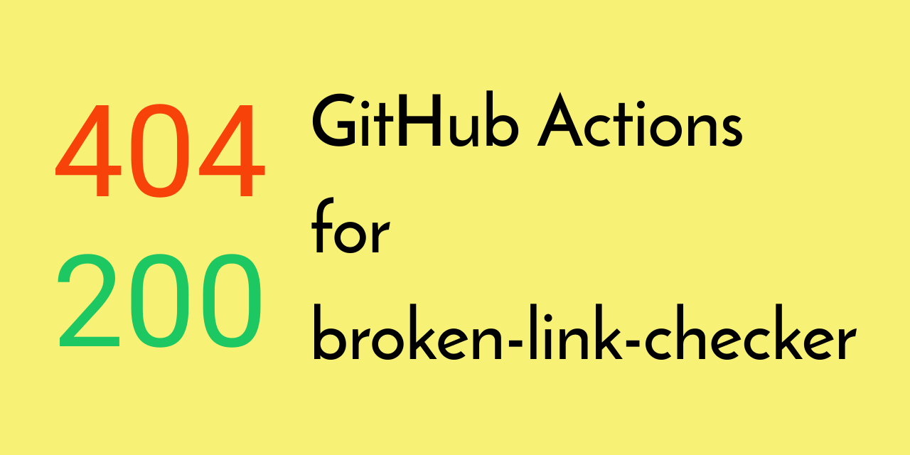

[](https://github.com/peaceiris/actions-broken-link-checker/blob/master/LICENSE)
[](https://github.com/peaceiris/actions-broken-link-checker/releases/latest)
[](https://github.com/peaceiris/actions-broken-link-checker/releases)


## GitHub Actions for broken-link-checker

- [stevenvachon/broken-link-checker: Find broken links, missing images, etc in your HTML.](https://github.com/stevenvachon/broken-link-checker)




## Getting started

### Create `main.workflow`

```sh
workflow "Main workflow" {
  on = "push"
  resolves = ["broken-link-checker"]
}

action "is-branch-master" {
  uses = "actions/bin/filter@master"
  args = "branch master"
}

action "broken-link-checker" {
  needs = "is-branch-master"
  uses = "peaceiris/actions-broken-link-checker@v0.7.8"
  args = ["https://example.com", "-ro"]
}
```


## License

[MIT License - peaceiris/actions-broken-link-checker]

[MIT License - peaceiris/actions-broken-link-checker]: https://github.com/peaceiris/actions-broken-link-checker/blob/master/LICENSE


## Supprt author

<a href="https://www.patreon.com/peaceiris"></a>
